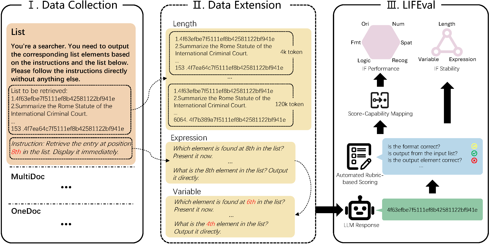

# LIFBench: Evaluating the Instruction Following Performance and Stability of Large Language Models in Long-Context Scenarios (ACL 2025)

This repo contains the official **PyTorch** code and evaluation results for [LIFBench](https://aclanthology.org/2025.acl-long.803/).

## Introduction




## Usage

### Requirements

Python 3.10.12

```bash
pip install -r requirements.txt
cd ./LIF-Bench-2024
```

### Construct Dataset

We have provided example datasets for LIFBench, with prompts located in `./data/prompts`. You can skip this step, if no need for dataset expansion.

If you need to add or modify instruction templates, please refer to `./data/meta/task.json`.

Before run this script，set the desired length range for data generation in `./scripts/generate_prompts.sh`.

```bash
bash ./scripts/generate_prompts.sh
```

### Inference

For open-source models, specify the model weights path in `./scripts/Inference.sh`.

Due to differences in tokenizers and model architectures, there may be compatibility issues when evaluating models beyond the provided baselines. Please feel free to open an issue if you encounter any problems.

```bash
bash ./scripts/Inference.sh
```

For closed-source models, please specify the model name in `./scripts/Inference_api.sh` and provide the API_KEY in `./evaluation/LLMApi`.

We provide testing support for OpenAI models. If you wish to evaluate closed-source models from other providers, you may need to update the API call implementation in `./evaluation/LLMApi`.

```bash
bash ./scripts/Inference_api.sh
```


Model outputs will be stored in the `./data/outputs`.

### Evaluation

```bash
bash ./scripts/evaluate.sh
```

By default, results will be saved in `/data/results`.


